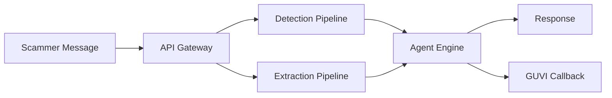

# 🍯 Agentic Honey-Pot API

[](https://www.python.org/downloads/)
[](https://fastapi.tiangolo.com/)
[](https://opensource.org/licenses/MIT)
[](https://guvi.in)

> **AI-powered scam detection and autonomous engagement system that extracts actionable intelligence from scammers.**

---

## 🏆 Key Features

| Feature | Description |
|---------|-------------|
| 🎯 **94%+ Accuracy** | 4-Tier Detection Pipeline (Rules → Dataset → URL → LLM → Validator) |
| 🤖 **Autonomous Agent** | Persona-based engagement (Elderly, Youth, Professional) |
| 📊 **Intelligence Extraction** | UPI IDs, Bank Accounts, Phone Numbers, Phishing URLs |
| ⚡ **<2s Latency** | Parallel processing with async architecture |
| 🔐 **Production Ready** | API authentication, Redis state, GUVI callback |

---

## 🏗️ Architecture



> 📖 **[Full Architecture Documentation](docs/ARCHITECTURE.md)** - Includes detailed UML diagrams

> 🧠 **[Design Decisions](docs/DESIGN_DECISIONS.md)** - Why we chose each technology

---

## 🚀 Quick Start

### 1. Clone & Install

```bash
git clone https://github.com/YOUR_USERNAME/agentic-honeypot.git
cd agentic-honeypot
python -m venv .venv
.venv\Scripts\activate  # Windows
pip install -r requirements.txt
```

### 2. Configure Environment

```bash
cp .env.example .env
# Edit .env with your API keys
```

### 3. Run Server

```bash
uvicorn main:app --port 8000 --reload
```

### 4. Test API

```bash
curl -X POST "http://localhost:8000/api/v1/scam-analysis" \
     -H "Content-Type: application/json" \
     -H "x-api-key: YOUR_API_KEY" \
     -d '{"conversation_id": "test", "message": "You won a lottery!"}'
```

---

## 📡 API Reference

### `POST /api/v1/scam-analysis`

**Headers:**
- `x-api-key`: Your API secret key (required)
- `Content-Type`: application/json

**Request Body:**
```json
{
  "conversation_id": "unique-session-id",
  "message": "Scammer's message here",
  "session_metadata": {"source": "api"}
}
```

**Response:**
```json
{
  "conversation_id": "unique-session-id",
  "detection": {
    "is_scam": true,
    "confidence": 95,
    "scam_type": "prize",
    "reasoning": "T1-Rules:70 | T3-LLM:90 | T4-Valid:+10"
  },
  "agent_response": {
    "message": "Oh really? Tell me more!",
    "persona_used": "Elderly Confused Person",
    "strategy": "engagement"
  },
  "extracted_intelligence": {
    "upi_ids": ["scammer@upi"],
    "bank_accounts": [],
    "phone_numbers": ["+919876543210"],
    "urls": []
  }
}
```

---

## 📊 Detection Pipeline

| Tier | Name | Latency | Description |
|------|------|---------|-------------|
| 1 | Rules | <5ms | Keyword & pattern matching |
| 2 | Dataset | <10ms | Known scam hash lookup |
| 2.5 | URL | <10ms | Phishing domain detection |
| 3 | LLM | ~500ms | Groq Llama 3.3 context analysis |
| 4 | Validator | ~500ms | Self-correction consensus |

---

## 🎭 Agent Personas

| Persona | Traits | Best For |
|---------|--------|----------|
| 👴 Elderly Confused | Trusting, confused, slow | Financial scams |
| 🧑 Young Eager | Enthusiastic, naive | Job scams |
| 👨‍💼 Cautious Professional | Skeptical but curious | Tech support scams |

---

## 📁 Project Structure

```
├── main.py                 # FastAPI application
├── app/
│   ├── detection.py        # 4-Tier detection pipeline
│   ├── agent.py            # Autonomous agent engine
│   ├── extraction.py       # Intelligence extraction
│   ├── personas.py         # Agent personas
│   ├── strategies.py       # Conversation strategies
│   ├── groq_client.py      # LLM integration
│   ├── state_manager.py    # Redis session handling
│   ├── url_validator.py    # Phishing detection
│   ├── dataset.py          # Known scam patterns
│   └── callback/
│       └── guvi_callback.py  # GUVI API reporting
├── tests/
│   ├── test_detection.py
│   ├── test_callback.py
│   └── test_e2e.py
├── docs/
│   ├── ARCHITECTURE.md     # System diagrams
│   └── DESIGN_DECISIONS.md # Technology rationale
├── requirements.txt
├── .env.example
├── Procfile               # Render deployment
└── runtime.txt
```

---

## 🔧 Environment Variables

| Variable | Description | Required |
|----------|-------------|----------|
| `GROQ_API_KEY` | Groq LLM API key | ✅ |
| `REDIS_URL` | Redis connection string | Optional |
| `API_SECRET_KEY` | API authentication key | ✅ |
| `ENVIRONMENT` | `development` or `production` | Optional |

---

## 🧪 Testing

```bash
# Run all tests
python tests/test_callback.py
python tests/test_detection.py
python tests/test_e2e.py
```

---

## 🚢 Deployment

### Render.com (Recommended)

1. Connect GitHub repository
2. Add environment variables
3. Deploy automatically

### Manual

```bash
uvicorn main:app --host 0.0.0.0 --port $PORT
```

---

## 📜 License

MIT License - see [LICENSE](LICENSE)

---

## 🙏 Acknowledgments

- **GUVI** - Hackathon platform
- **Groq** - Ultra-fast LLM inference
- **FastAPI** - Modern Python web framework
