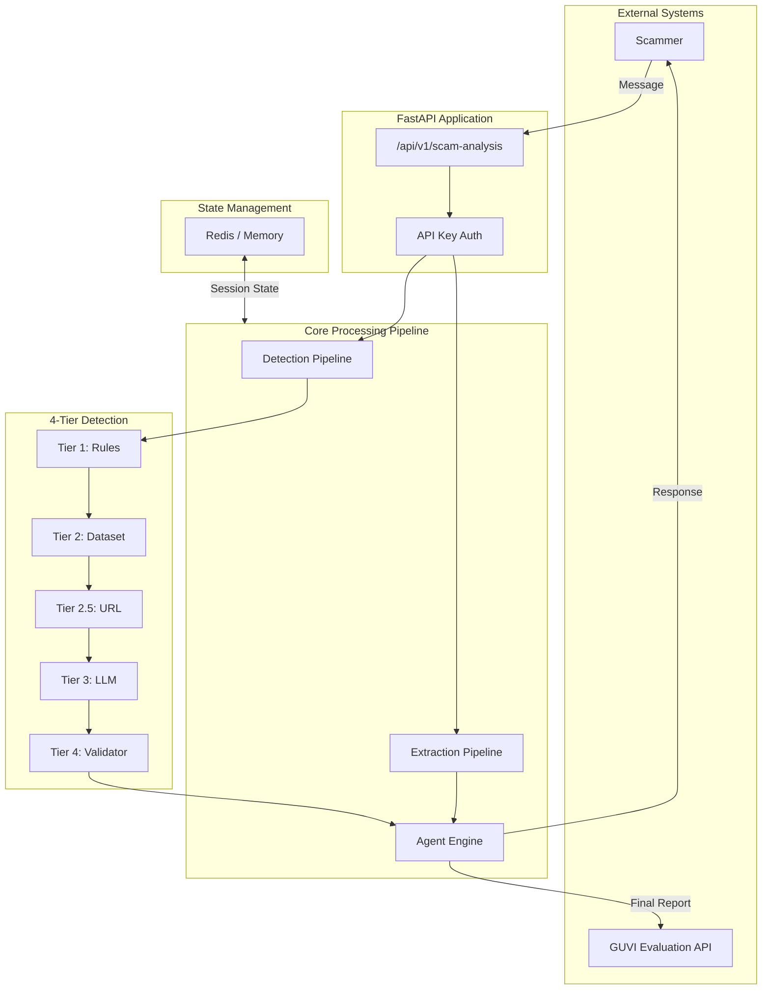
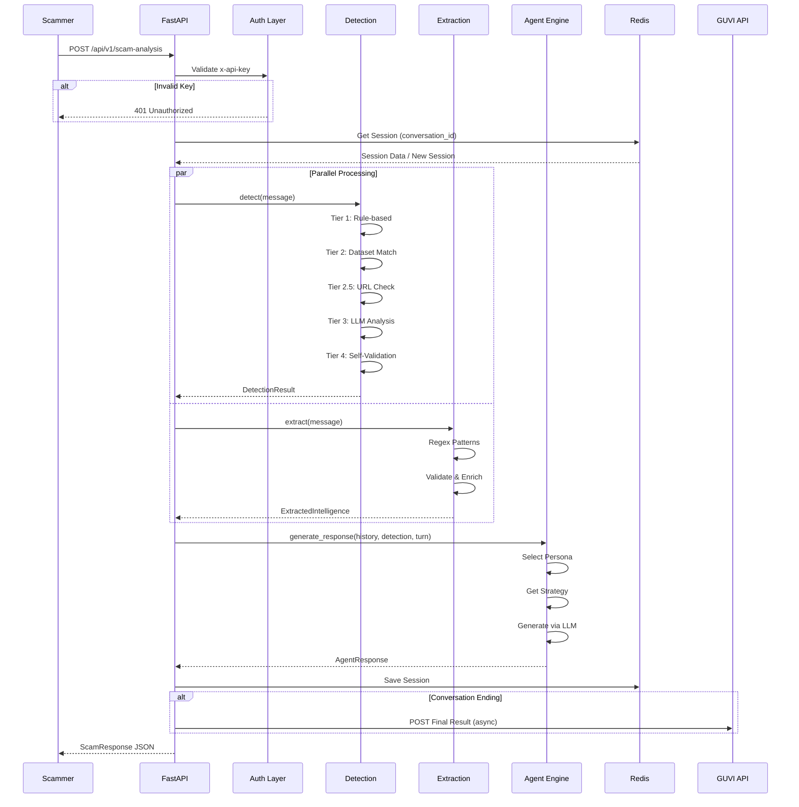
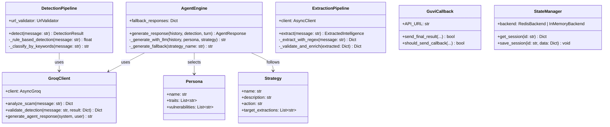
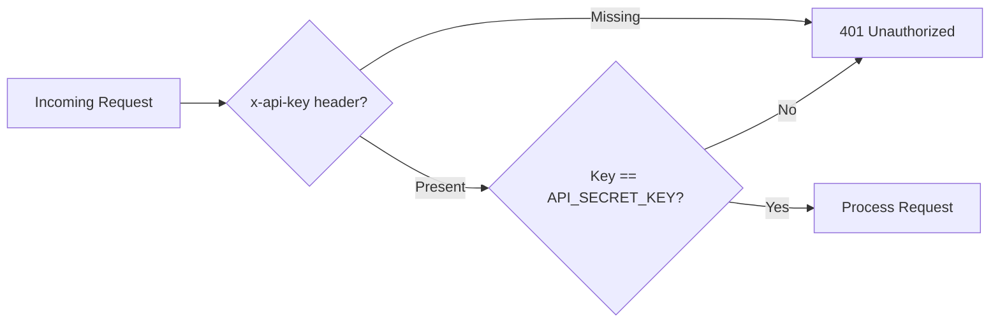

# 🏗️ System Architecture

This document provides a comprehensive overview of the Agentic Honey-Pot system architecture, including UML diagrams and component explanations.

---

## 📊 High-Level Architecture

---

## 🔄 API Request Sequence Diagram

---

## 🧩 Class Diagram

---

## 📦 Component Overview

| Component | File | Responsibility |
|-----------|------|----------------|
| **API Layer** | `main.py` | Request handling, auth, orchestration |
| **Detection** | `app/detection.py` | 4-tier scam classification |
| **Extraction** | `app/extraction.py` | UPI, Bank, Phone, URL extraction |
| **Agent** | `app/agent.py` | Persona-based response generation |
| **Personas** | `app/personas.py` | Character definitions (Elderly, Youth, Pro) |
| **Strategies** | `app/strategies.py` | Conversation flow control |
| **LLM Client** | `app/groq_client.py` | Groq API wrapper |
| **State** | `app/state_manager.py` | Redis/Memory session storage |
| **Callback** | `app/callback/guvi_callback.py` | GUVI result submission |
| **URL Validator** | `app/url_validator.py` | Phishing link detection |
| **Dataset** | `app/dataset.py` | Known scam pattern matching |

---

## 🔐 Security Flow

---

## 📈 Data Flow

1. **Input**: Scammer message arrives via POST
2. **Auth**: API key validated
3. **State**: Session loaded/created from Redis
4. **Parallel**:
   - Detection runs 4 tiers
   - Extraction runs regex + validation
5. **Agent**: Generates contextual response
6. **Output**: JSON response returned
7. **Callback**: If ending, report to GUVI (async)
